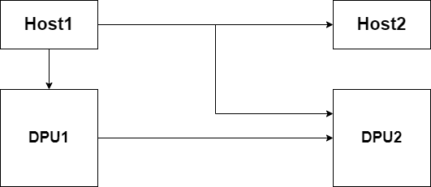
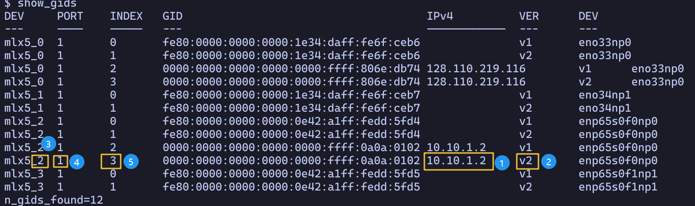

# DOCA lib

## install dependencies

```
pip instal meson ninja
```

## build the library

```
meson setup build
ninja -C build/ -v
```

### integrate with other code base

This project will be compiled as a static library to be linked with other codes.

The static binary will be `libDOCA_lib.a` under the project directory after compilation.

### make


```
-L/path/to/this/repo -lDOCA_lib -libverbs
```

To use this library with a meson project, simply add `subdir('<path_to_this_lib>')` and then use the `libDOCA_lib_dep` in the dependencies of the compilation target.


Also add the `-I/path/to/DOCA_lib/include` to the cflags

### meson

Compile this code base to get the static library, then 

```
incdir = include_directories('DOCA_lib/include')
doca_lib_dep = declare_dependency(
  include_directories: incdir,
  link_args: ['-L' + root_dir + '/DOCA_lib', '-lDOCA_lib', ]
  )
```

Add the incdir to the include_directories of your target, then add the `doca_lib_dep` to the dependencies of your target.

## experiment settings

In this experiment, we want to verify the connection between different link with the `ib_send_bw` tool and also the program compiled from this liabrary(`./build/rdma_send` and `./build/rdma_receive`)



In this figure, DPU1 is installed on host1. DPU2 is installed on host2.

We will verify the if the connection between these pairs.

1. host1 <-> host2
2. host1 <-> DPU1
3. host1 <-> DPU2
4. DPU1 <-> DPU2

### determine RDMA specific settings for the ib_send_bw tool and run

The `-d`, `-x`, `-i` options are related to RDMA. These settings should be adjusted on a per node basis.

Please follow the following steps to determine these values.


1. run the command `show_gids` and determine a interface to use, note the interfaces on two nodes should in same IP sub network so they can talk to each other.

2. Choose the row with v2 instead of v1, which stands for RoCEv2 support.

3. determine the device name, which is full name of the device pointed by the blue circle 3, the yellow square is the index of the device. In this example, the device name is `mlx5_2`.

4. determine the ib port setting(`-i`), which is the number in the yellow sqaure labeled 4.

5. determine the sgid index setting(`-x`), which is the number in the yellow sqare labeled 5.

After these steps, we can provide the node specific options to the `ib_send_bw` test to check if the RDMA connection between two end point is working or not.

First, we should start the server on one endpoint with `ib_send_bw -d <device_name> -x <gid_index> -i <ib_port>`

Then, start the client in another endpoint with `ib_send_bw -d <device_name> -x <gid_index> -i <ib_port> <ip_address>`

The IP address should be the address of the server endpoint.

Then for the each pair of endpoint run the ib_send_bw tool, note it does not matter which endpoint runs the server.

Examples of the commands are

```bash
# server
ib_send_bw -d mlx5_3 -i 1 -x 1
# client
ib_send_bw -d mlx5_3 -i 1 -x 1 192.168.0.3
```

### determine RDMA settings for `rdma_send` and `rdma_receive`

The two binary will be compiled under the build directory of this repository.

The `rdma_send` will be the server and the `rdma_receive` would be the client.

We need to determine the `-d`(devide name) and `-g` gid index. Please check the related steps in previous [subsection](#determine-rdma-specific-settings-for-the-ibsendbw-tool-and-run)

Also we should provide a port by `-p` on both side, which will be used by the `rdma_send` to listen incomming connections.

On the client side, we will provide the `-a`(server_ip_address).


Examples of the commands are

```bash

# server
./build/rdma_send -d mlx5_3 -p 10000 -g 1
# client
./build/rdma_receive -d mlx5_3 -p 10000 -g 1 -a 192.168.0.4
```

Note to first run the server then run the client, after the server print `All RDMA receive tasks have been successfully submitted`

go back to the server, it should print `Please press enter after all the receive tasks have been successfully submitted in the receiver side`

press enter to continue the program.


